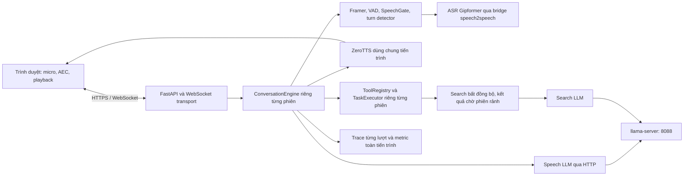

# Rà soát kiến trúc và độ ổn định voice-platform — 28/09/2026

**Kết luận: kiến trúc có nền tảng tốt và stack mock chạy được, nhưng hệ thống thật hiện chưa hoạt động đầy đủ; chưa đủ điều kiện kết luận ổn định để vận hành lâu dài hoặc phục vụ nhiều người.**

Phạm vi gồm code đang nằm trong workspace, cấu hình, tài liệu, toàn bộ test hiện có, smoke WebSocket trên server riêng và các phép thử ngắn trên server HTTPS cổng 18100. Các lỗi bất đồng bộ được tái hiện riêng bằng mock, không thay model trên server thật. Không sửa mã nguồn, cấu hình hoặc khởi động lại dịch vụ. Các thay đổi chưa commit có sẵn được giữ nguyên. Các phiên kiểm tra thật có thể tạo trace như phiên sử dụng thông thường.

## Kiến trúc thực tế

Điểm tốt đã đối chiếu với code và test:

- Model dùng chung tiến trình, trạng thái hội thoại tách theo phiên; registry tool được dựng riêng nên giảm nguy cơ nối chéo kết quả.
- VAD tách khỏi quyết định hết lượt. Bridge ASR có partial để heuristic tiếng Việt có dữ liệu làm việc.
- Generation fencing và playback reset có ở server và client; có test ngắt lời trước tiếng đầu, khi đang nói, ho/đệm ngắn và resume.
- Search chạy ngoài đường trả lời chính, có TTL và giới hạn inflight theo phiên. Tool có xử lý lỗi, filler và kiểm tra kết quả cũ.
- Test cover nhiều tình huống state machine, watchdog, cancellation, segmentation, trace và đổi giọng theo phiên.

Các giới hạn kiến trúc hiện tại:

- Đây là một ứng dụng Python một tiến trình với nhiều coroutine, không phải nhiều dịch vụ độc lập. Hai vai trò LLM hội thoại và search hiện vẫn phụ thuộc cùng endpoint 8088.
- TTS có một lock dùng chung; nhiều phiên phải chờ tổng hợp tuần tự. `tasks.max_parallel` cũng là giới hạn theo executor/phiên, không phải trần tài nguyên toàn server.
- Search `backend: llm` hiện hỏi một LLM khác, chưa có nguồn tra cứu bên ngoài. Đây không phải khả năng tìm kiếm dữ liệu được xác minh.
- WebRTC, native S2S, half-cascade và semantic detector bằng model chưa có triển khai hoàn chỉnh. Luồng đã kiểm tra là cascade qua WebSocket.
- Không thấy service unit dành cho voice-platform trong repo hoặc các thư mục systemd đã kiểm tra. PID đang chạy nằm trong một session scope; chưa có bằng chứng về cơ chế tự phục hồi tiến trình này.

## Kết quả kiểm tra

| Hạng mục | Kết quả | Ý nghĩa |
|---|---|---|
| `./scripts/smoke.sh` | 157 test PASS, 1 cảnh báo; demo hoàn tất; `SMOKE OK`, 81 frame audio | Logic và transport với mock chạy được |
| HTTPS 18100 | Đang lắng nghe `0.0.0.0`; `/healthz` HTTP 200, `ok: true` | Tiến trình API còn sống |
| LLM 8088 | Không có listener; gọi `/v1/models` lỗi kết nối | Dependency hội thoại không hoạt động |
| `/try/llm` | HTTP 400, `All connection attempts failed` | Không sinh được câu trả lời thật |
| `/try/search` | HTTP 200 nhưng `ok: false`, cùng lỗi kết nối | Tra cứu không hoạt động; phải kiểm tra body |
| `/try/tts` lần đầu | Tiếng đầu 2420,2 ms; RTF 2,0338 | Cold/idle path rất chậm trong thời điểm đo |
| TTS lặp lại 3 lần | Tiếng đầu 152,4 / 139,9 / 181,7 ms; RTF 1,1486 / 1,2041 / 1,3135 | Tiếng đầu cải thiện nhưng tổng hợp vẫn chậm hơn thời lượng audio |
| ASR trên câu TTS 2,8 giây | Nhận được “xin chào đây là phép kiểm tra hệ thống”, decode 1327,1 ms | Chặng ASR chạy được trên một mẫu ngắn |
| WebSocket lượt gõ | Có 86 frame audio, về idle, trace có lỗi `stage: llm` | Audio là câu fallback; không phải một câu trả lời thành công |
| Một lượt nói thật | ASR partial và final chạy; trace vẫn lỗi LLM | Đường audio đầu vào chạy, nhưng toàn pipeline không thành công |
| `check_full_turn` hiện có | Báo PASS trên chính lượt nói bị lỗi LLM | Bài kiểm tra có thể báo thành công giả |

RTF là thời gian tổng hợp chia cho thời lượng audio. Các lần đo RTF > 1 cho thấy nguy cơ đứt quãng khi phát streaming; chưa đo trực tiếp chất lượng loa, tiếng vọng hoặc tiếng giật trong trình duyệt. Lúc lấy mẫu, máy còn khoảng 23,3 GiB RAM khả dụng và swap đã dùng khoảng 98,2%; đây là bối cảnh tài nguyên, chưa đủ để quy nguyên nhân chậm cho swap.

WER 22,22% của mẫu ASR trong evidence chủ yếu đến từ dấu câu trong reference; không dùng con số này để kết luận chất lượng nhận dạng tiếng Việt. Bài thử ASR đẩy audio nhanh nên `partials: 0` không chứng minh ASR realtime mất partial; lượt nói WebSocket riêng có partial.

## Các vấn đề cần xử lý

P1: ảnh hưởng trực tiếp khả năng sử dụng, khiến kiểm tra báo khỏe sai, hoặc gây hỏng khi vận hành chức năng có sẵn. P2: cần xử lý trước khi mở rộng hoặc chạy lâu dài. Vấn đề runtime và lỗi trên code workspace được phân biệt dưới đây.

### 1. P1 — LLM đang ngừng hoạt động, nhưng readiness vẫn báo khỏe

**Đã xác nhận trên server thật.** Cấu hình mà server trả về trỏ cả LLM và search vào `http://127.0.0.1:8088/v1`. Cổng này không lắng nghe, cả hai phép thử đều lỗi. Tuy vậy `/healthz` luôn trả `ok: true` ở [server.py](/home/ai01/AIHoang/voice-platform/src/voiceplatform/app/server.py:140).

`OpenAiCompatLlm.start()` chỉ tạo HTTP client, không kiểm tra endpoint hoặc model thực sự sẵn sàng: [openai_compat.py](/home/ai01/AIHoang/voice-platform/src/voiceplatform/models/llm/openai_compat.py:62). CLI `doctor` cũng chủ yếu dựng adapter và mô tả capabilities, không chứng minh model phục vụ được yêu cầu.

Ưu tiên khôi phục dependency LLM hoặc cập nhật endpoint phù hợp, sau đó kiểm tra một câu trả lời thực. Tách liveness và readiness; readiness cần phản ánh dependency lỗi, có timeout ngắn và cache kết quả để tránh mỗi health request tạo thêm tải model. Bổ sung số lượt thành công, lỗi model và fallback vào metric; TTFA thấp hiện có thể chỉ là tiếng báo lỗi hoặc câu mở.

### 2. P1 — Tiến trình phục vụ có trước các sửa đổi code

**Đã xác nhận thời điểm trên máy.** PID 1737265 chạy từ 24/09/2026 16:56:35. `server.py`, `access.py`, `engine.py`, `client.js` và `local-cpu.yaml` đều có mtime ngày 25/09. Lệnh chạy là interpreter của `speech2speech`, `-m voiceplatform --config configs/local-cpu.yaml serve --lan`.

Các module Python đã import vào tiến trình không tự nạp lại khi sửa file. Frontend static lại được đọc từ đĩa, nên còn có khả năng trang mới giao tiếp với backend cũ. Do đó **157 test trên code hiện tại không xác nhận tiến trình đang phục vụ có các bản sửa đó**.

Sau khi giải quyết dependency, cần khởi động lại có kiểm soát và thêm build/git revision cùng thời điểm startup vào endpoint trạng thái. Dùng service manager để quản lý cả dependency và ứng dụng. Cuộc rà soát này không tự restart vì yêu cầu hiện tại là kiểm tra hệ thống.

### 3. P1 — Bài kiểm tra hội thoại có thể PASS khi chỉ nghe fallback

**Tái hiện trên server thật:** `check_full_turn()` trả `True` dù trace của lượt đó có lỗi LLM và `llm_ttft_ms: null`; ASR nghe được “bây giờ là mấy giờ rồi”, còn đầu ra chỉ là fallback.

Ở [conversation_check.py](/home/ai01/AIHoang/voice-platform/scripts/conversation_check.py:204), điều kiện là có audio; kết quả chờ idle không được kiểm tra, rồi hàm trả PASS. Bài kiểm tra cần xác nhận kết thúc lượt, không có lỗi ASR/LLM/TTS, có nội dung trả lời, và phân biệt audio fallback/filler với nội dung thật. Không dùng smoke mock hoặc điều kiện “có tiếng” để chứng nhận stack thật ổn định.

### 4. P1 — Lỗi trước khi tạo generator TTS làm consumer chờ vô hạn

**Tái hiện bằng fault injection trên code workspace.** Khi `synthesize_stream()` ném lỗi ngay lúc gọi, consumer không nhận được lỗi hay tín hiệu kết thúc; phải dùng timeout bên ngoài để dừng. Có lỗi background không được thu nhận.

Ở [zerotts.py](/home/ai01/AIHoang/voice-platform/src/voiceplatform/models/tts/zerotts.py:152), lời gọi tạo stream nằm ngoài `try`. `stream.close()` cũng có thể ném lỗi trước khi gửi sentinel. Trong khi đó consumer chờ `queue.get()` mà không kiểm tra worker đã chết.

Đưa cả tạo stream và đóng stream vào đường xử lý lỗi; đảm bảo luôn gửi tín hiệu hoàn tất, đồng thời thu nhận exception của worker. Thêm timeout cho bài thử TTS/prewarm. Watchdog của lượt hội thoại không bảo vệ đầy đủ các đường `/try/tts` và cache prewarm.

### 5. P1 — Đổi model vẫn có thể đóng model đang được phiên mới sử dụng

**Tái hiện bằng mock:** bắt đầu swap khi không có phiên; trong lúc `engine.start()` chờ, một phiên mới kết nối; swap vẫn thành công và đóng model cũ khi có 1 phiên live.

[lab.py](/home/ai01/AIHoang/voice-platform/src/voiceplatform/app/lab.py:178) chỉ kiểm tra `platform.sessions` trước quá trình nạp có `await`. Lock của lab không khóa việc mở WebSocket ở [server.py](/home/ai01/AIHoang/voice-platform/src/voiceplatform/app/server.py:202).

Cần trạng thái maintenance hoặc lock dùng chung giữa swap và admission phiên mới, kèm kiểm tra lại trước khi chuyển model. Kiểm tra lại trong riêng lock của lab vẫn chưa đủ nếu WebSocket không phối hợp cùng cơ chế.

### 6. P1 khi dùng credential thật — API công khai trả toàn bộ model options

**Tái hiện trên app workspace bằng client giả lập ngoài máy chủ**, với `private_introspection: true` và API key giả `audit-fake-secret`. `/sessions` trả 403, nhưng `/engines` trả 200 và lộ key giả. [LabService.describe()](/home/ai01/AIHoang/voice-platform/src/voiceplatform/app/lab.py:127) trả nguyên `spec.options`.

Đây là nguy cơ có điều kiện nếu cấu hình chứa API key/credential; **không phát hiện hay in credential thật trong cuộc rà soát**. Endpoint công khai cho trang web chỉ nên trả capabilities và danh sách giọng; options quản trị cần quyền truy cập hoặc được loại bỏ các trường bí mật.

Ngoài ra `/sessions/{id}/turns` vẫn trả transcript cho client ngoài máy nếu biết id, dù `/sessions` bị khóa: [server.py](/home/ai01/AIHoang/voice-platform/src/voiceplatform/app/server.py:168). Đây hiện là mô hình truy cập dựa trên việc biết session id, chưa có xác thực chủ sở hữu. Khi triển khai có dữ liệu người dùng, cần token/quyền theo phiên để client đọc được trace của mình và không đọc được phiên khác.

### 7. P2 — Tool sống sót sau khi lượt và phiên bị đóng; deadline bỏ qua thời gian xếp hàng

**Tái hiện bằng mock:** hủy caller trong thời gian đợi filler rồi đóng engine; tool vẫn đang chạy và hoàn tất sau khi phiên đã đóng.

[_run_tool()](/home/ai01/AIHoang/voice-platform/src/voiceplatform/conversation/engine.py:745) tạo task bằng `ensure_future()`. Hủy caller đang `asyncio.wait()` không hủy task con; task này cũng không được đăng ký với generation manager. Cần sở hữu task rõ ràng và cancel/await trong `finally` khi lượt đồng bộ bị hủy. Search bất đồng bộ được thiết kế sống qua ngắt lời là một đường riêng, không nên áp dụng cùng vòng đời cho tool đồng bộ.

Ở [executor.py](/home/ai01/AIHoang/voice-platform/src/voiceplatform/tasks/executor.py:66), semaphore được chờ trước `wait_for()`. Probe với ngân sách 50 ms vẫn chờ sau 120 ms rồi trả thành công. Nếu deadline là ngân sách trọn lời gọi, phải bao gồm cả thời gian chờ slot.

### 8. P2 — Cấu hình không kiểm tra miền giá trị; lịch sử phiên không có trần lưu trữ

**Tái hiện trên code workspace:** `frame_ms: 0`, `max_parallel: 0` và `models.mode: imaginary` được nhận. [_build()](/home/ai01/AIHoang/voice-platform/src/voiceplatform/core/config.py:281) chặn key lạ nhưng không kiểm tra kiểu hay giới hạn. `frame_ms: 0` dẫn đến `frame_samples: 0`; vòng chia frame không tiêu thụ buffer. Không chạy vòng lặp này để tránh làm treo máy. `max_parallel: 0` khiến tool chờ slot mãi.

`history_turns` chỉ giới hạn số lượt đưa vào prompt, không giới hạn `context.turns`: [context.py](/home/ai01/AIHoang/voice-platform/src/voiceplatform/conversation/context.py:33). Probe cấu hình giữ 2 lượt vẫn lưu 1000 lượt. Cần validation dương/hữu hạn, enum cho backend/mode và giới hạn lưu trữ riêng cho lịch sử dài.

## Thứ tự xử lý đề xuất

1. Khôi phục LLM, đồng bộ phiên bản server với workspace và xác minh câu trả lời thật; readiness phải đỏ khi dependency chết.
2. Sửa điều kiện PASS của kiểm tra hội thoại; bổ sung các probe lỗi TTS, swap và tool cancellation vào regression suite.
3. Sửa vòng đời task/thread, phối hợp admission với swap và loại credential khỏi API công khai.
4. Đo và xử lý throughput TTS trên điều kiện tài nguyên thực; bổ sung giới hạn session/queue, validation, bounded history và retention trace.
5. Sau khi các điểm trên được xử lý, chạy lại đủ 5 tình huống hội thoại thật, đo nhiều mẫu p50/p95, thử mức đồng thời mục tiêu và chạy liên tục đủ thời gian sử dụng dự kiến. Kiểm tra micro/AEC/playback trong trình duyệt và phục hồi khi dependency mất kết nối.

Dependency hiện dùng ràng buộc `>=` và chưa có lock trong repo; môi trường mock còn có cảnh báo Starlette/httpx. Cần cố định phiên bản và interpreter của deployment để tái lập các kết quả. README/ROADMAP vẫn ghi 89 test trong khi workspace hiện chạy 157 test.

## Bằng chứng và giới hạn

- [runtime-evidence.json](runtime-evidence.json): health, endpoint thực, kết quả từng model và phiên WebSocket lượt gõ.
- [tts-repeat.json](tts-repeat.json): 3 lần đo TTS nối tiếp sau lần đo đầu.
- [live-turn-probe.json](live-turn-probe.json): lượt audio thật, lỗi LLM và việc `check_full_turn` vẫn trả PASS.
- [failure-probes.json](failure-probes.json): kết quả tái hiện lỗi bằng mock.
- [failure-probes.py](failure-probes.py): cách tái hiện các lỗi workspace; chạy từ root dự án bằng `.venv/bin/python docs/audits/2026-09-28/failure-probes.py`. Không tải model, không cần network và không đổi server thật; script ghi kết quả vào `/tmp`.

Các test hiện có chạy với mock. Các phép thử thật chỉ gồm một vài câu ngắn, trên tiến trình có trước sửa đổi workspace. Chưa thực hiện soak test, load test stack LLM hoạt động, xác minh đủ 5 tình huống thoại thật, thử mạng suy giảm hoặc nghe/đo trình duyệt. Các con số lịch sử trong README và `/metrics` không thay thế những kiểm tra này. Không thể xác nhận độ ổn định dài hạn từ số test PASS hoặc uptime tiến trình.
