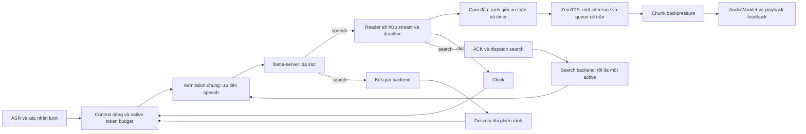

# G2 — triển khai tuần 2

Ngày 29/09/2026. Phạm vi: cascade tiếng Việt trên host GB10 hiện tại, tối đa ba phiên. Kết quả nghiệm thu và giới hạn nằm ở [REPORT.md](REPORT.md). Các thay đổi G0/G1 có sẵn được giữ nguyên.

## Cấu hình chốt



Hai đường LLM chia sẻ admission và native slots; TTS là điểm serialize riêng.
Diagram không mô tả mọi state của turn detection/barge-in; xem code và trace để
đánh giá ngắt lời. Số phiên được nhận không đồng nghĩa capacity audio liên tục.

- LLM: Qwen3.5-4B Q4_K_M có sẵn, `temperature=0`, `seed=20260929`, `enable_thinking=false`; native server cũng chạy `--reasoning off`. Không suy diễn mọi model đều hỗ trợ tùy chọn này.
- llama-server: đúng binary đang cài, ba slot, mỗi slot 4096 token; context tổng 12288, batch/ubatch 256/256, cache prompt bật, cache RAM 1024 MiB. Profile được kiểm tra trước `execv`, không dựng shell command từ config.
- Prompt hội thoại ngắn, hướng dẫn công cụ đứng trước phong cách; `{tool_routes}` chỉ chứa công cụ thực sự có trong request. Prompt chốt là [prompt-v8-negative.yaml](prompt-v8-negative.yaml); cấu hình phục vụ là [local-cpu.yaml](../../../../configs/local-cpu.yaml).
- Prompt budget 1800 token, tính bằng native `/apply-template` và `/tokenize` trên body thực tế gồm tools. Giữ system prefix và toàn bộ nhóm user/tool của yêu cầu mới nhất; bỏ nhóm lịch sử cũ nguyên vẹn. Không sửa lịch sử caller. Request mới nhất vượt budget được báo lỗi rõ, không âm thầm cắt tên/số. Reserve completion và 64 token headroom phải vừa context thực tế.
- `literal_request_policy=true`: đọc lại/lặp nguyên văn/dịch có dấu phân cách literal dùng system instruction riêng và không gửi tools. Câu hỏi giờ thật vẫn có tools. Đây là quy tắc nhận diện có giới hạn, không phải bộ hiểu ý định tiếng Việt tổng quát. A/B chốt so **model cùng adapter policy**, không được gọi là so model thuần.
- LLM hội thoại và search dùng chung admission khi cùng endpoint: ba slot, tối đa tám yêu cầu chờ, search tối đa một active, ưu tiên speech và dành năng lực cho speech. Khác endpoint thì limiter độc lập. Deadline bao gồm queue, chuẩn bị prompt và streaming HTTP.
- ZeroTTS Kimoanh, revision `c2bfbd67dc648cac455077333f7cf5c18a2e3bb4`, local-only, bốn thread cho acoustic/codec; một inference, queue sáu, pending chunk bốn, chunk tối đa tám frame. Giữ spinning mặc định vì các profile 1ms không cải thiện đều throughput và khoảng hụt.
- Trước admission: nạp model, warmup có hạn, warm ASR/TTS và cache câu opener/ACK/filler. LLM warmup chỉ dùng prefix cố định, không dùng lịch sử riêng của một phiên để phục vụ phiên khác. Keep-warm sau idle 240 giây, bỏ qua khi bận. Có giới hạn và lỗi startup/prewarm làm readiness thất bại.
- Cụm đầu tối đa 48 ký tự, các cụm sau dài hơn; timer gom cụm đầu 250ms từ token nội dung đầu tiên. Opener có điều kiện sau 800ms để giảm tiếng “Vâng” chen vào câu đã gần sẵn; vẫn tách role filler khỏi content.

## Cụm đầu, deadline và worker

`conversation/first_phrase.py` dùng một task sở hữu toàn bộ async stream LLM và queue một phần tử. Timer chỉ chờ queue; không tạo một task khác cho mỗi `anext`. Cách trước làm mất ownership của `asyncio.timeout` qua các lần yield, khiến deadline sau token đầu không còn đúng. Hai regression test đã thất bại trước sửa và chạy qua sau sửa: deadline sau token đầu và flush ngay khi từ mới tới sau khi timer hết hạn. Log trước sửa vẫn giữ trong `logs/g2-timer-before-fix.log`.

Timer chỉ yêu cầu segmenter flush ở ranh giới an toàn. Không hard-cut mã dài; bảo vệ nhóm tên viết hoa, dãy số và đơn vị, câu hỏi ngắn chưa có dấu kết thúc. Ranh giới câu/ý chỉ là heuristic, chưa có điểm chấm prosody từ người nghe. Khi cancel, reader được cancel/join và HTTP stream đóng trong task sở hữu nó.

ZeroTTS đo riêng admission queue, lock wait và inference; native worker vẫn sở hữu lock tới khi thực sự kết thúc dù consumer bị cancel. Chunk có backpressure và mọi lỗi/kết thúc được chuyển tới consumer. Pool thử nghiệm hai/ba lease có giới hạn, không trả lease trước khi native worker dừng; sharing graph chỉ cho CPU và trạng thái sinh âm riêng từng generator. Pool được unit test và benchmark thật, nhưng không bật trong cấu hình chốt vì khoảng hụt âm câu dài tăng.

## Đo và quyết định model

Các script mới: `benchmark_g2_native.py`, `benchmark_g2_llm.py`, `evaluate_g2_gates.py`, `benchmark_g2_tts.py`. Native harness sở hữu server riêng 18208, ghi profile/build/binary hash, kiểm tra context mỗi slot, dừng đúng tiến trình của nó. Không dừng workload khác trên host.

Gate được khai báo trước chạy chốt: direct ≥95%, recall riêng clock/search ≥95%, false tool ≤5% trên nhóm no-tool, memory ≥95%, mức giảm accuracy tổng trên mẫu so với 9B ≤2 điểm phần trăm, language proxy 8/8. Release3 khóa suite/source/prompt/options trước outputs: 4B đạt 126/128, 9B 127/128; zero false tool trên 24 ca mỗi model. Hai lỗi 4B vẫn ghi trong [release3-decision.json](release3-decision.json).

Các suite 64/120, release1/release2 và biến thể đã dùng để chỉnh model/prompt là **development**. Release3 là confirmation theo quy trình, cùng tác giả và các họ câu hỏi tương tự; không có người chấm độc lập, không chứng minh noninferiority trên quần thể. Không xóa các lần thất bại. Qwen2.5-7B từng vượt release1 nhưng bị loại sau regression ngôn ngữ/CJK ở câu hội thoại. Qwen3-4B và các prompt khác không vượt toàn bộ gate. Qwen3-8B có 8.2B tham số theo card chính thức nên không tải trong phạm vi 1–8B.

Cache/slot/batch/context được thử từng yếu tố trên cùng native build. Các thử này là development trên shared host, chủ yếu Qwen2.5-7B, không quy tất cả mức cải thiện của cấu hình chốt 4B cho một biến duy nhất. Cache OFF làm TTFT tải ba tăng mạnh; ba slot 4096 và batch256 được giữ để có headroom vừa phải. Nâng batch512 không đủ lợi ích để chọn thêm độ phức tạp. Cache RAM bị chặn 1GiB sau sự cố áp lực RAM; giữ incident và failed transport runs riêng, không chấm chúng thành lỗi kiến thức model.

## Đo TTS và playback

ZeroTTS và Nano talker sẵn có được đo cùng sáu câu, 24kHz, tải một/ba, có raw chunk và WAV. Nano tiếng đầu p95 khoảng 1068ms so với Zero khoảng 100ms ở screen serial; RTF riêng cả hai có thể dưới một. Giọng hai engine khác nhau; chưa nghe chấm mù nên **không kết luận Zero có chất lượng nghe tốt hơn**.

Chia chunk 16→8 frame giữ chuỗi frame/phoneme; so WAV cùng seed giữ số sample, bốn trong 12 mẫu bitwise giống, các mẫu khác sai khác tối đa một đơn vị int16. Đây là bằng chứng waveform không đổi đáng kể, không thay thế MOS. Pool ba cho tiếng đầu nhanh nhưng RTF p95 >1 và có simulated gap 36/36. Pool hai giảm queue nhưng gap 21/36, p95 306ms, so với một worker 2/36, p95 0.615ms. Vì người dùng báo audio vấp, giữ một worker. Ba luồng đọc dài liên tục chưa có capacity đủ.

Bộ đo G1 được tái sử dụng cho pipeline thật: cùng WAV, ASR, LLM, TTS và Chromium AudioWorklet; 200 lượt một phiên và 68 batch×3=204 lượt ba phiên. Giữ context rolling như sản phẩm. Không gộp ca natural/tool/idle vào direct. Nội dung/filler/ACK/fallback có mốc riêng. Playback là render clock browser loopback, không phải âm thanh được đo tại loa vật lý. Proxy last-speech dùng tín hiệu PCM tổng hợp; chưa phải nghiệm thu micro/LAN/room.

## Kiểm chứng và hoàn tác

216 Python tests và một Node playback test đã qua trên source chốt; xem [test-results.json](test-results.json). Các smoke runtime, fingerprints, raw pipeline và resource samples nằm cùng thư mục này. Source dirty được xác định bằng SHA256, không chỉ git commit. Dependency không upgrade; interpreter deployment vẫn ở venv `speech2speech` đã pin.

Fallback 9B đã vượt cùng release3/prompt/policy: `configs/local-g2-9b.yaml` và `configs/llama-g2-9b.json`. Khi không có phiên đang hoạt động, dừng hai unit, sao chép hai file tương ứng sang `local-cpu.yaml`/`llama-local.json`, khởi động LLM và chờ health rồi khởi động API, chờ ready/prewarm. Không đổi mỗi alias mà giữ weights cũ. Profile G1 nguyên bản được giữ trong `llama-baseline-9b.json` và snapshot G1. Không dùng git reset trên workspace chung.

Tham chiếu primary: [Qwen3.5-4B](https://huggingface.co/Qwen/Qwen3.5-4B), [Qwen2.5-7B](https://huggingface.co/Qwen/Qwen2.5-7B-Instruct), [Qwen3-8B](https://huggingface.co/Qwen/Qwen3-8B), [llama.cpp server](https://github.com/ggml-org/llama.cpp/blob/master/tools/server/README.md), [ONNX Runtime threading](https://onnxruntime.ai/docs/performance/tune-performance/threading.html). Flag/key được đối chiếu thêm với help và binary thực tế đang cài.

## Tái chạy trên môi trường đã ghi

Giữ service chính đúng config chốt và dependency trong model manifest; dùng API
benchmark riêng 19101 như runbook. Không ghi đè raw evidence của đợt này. Với
Playwright/browser có sẵn, chạy từ root repository:

```bash
node scripts/benchmark_g1.cjs --base https://127.0.0.1:19101 \
  --sessions 1 --rounds 200 --cases direct \
  --stimuli docs/audits/2026-09-28/g1/stimuli/stimuli.json \
  --output /tmp/g2-repro/baseline-1
node scripts/benchmark_g1.cjs --base https://127.0.0.1:19101 \
  --sessions 3 --rounds 68 --cases direct \
  --stimuli docs/audits/2026-09-28/g1/stimuli/stimuli.json \
  --output /tmp/g2-repro/baseline-3
.venv/bin/python scripts/summarize_g2.py \
  /tmp/g2-repro/baseline-1 /tmp/g2-repro/baseline-3 \
  --output /tmp/g2-repro/summary.json
```

Quality A/B dùng `benchmark_g2_native.py`: profile `native-release-profiles.json`,
config `prompt-v8-negative.yaml`, suite `quality-release3.json`, options
`llm-budget-literal.json`, model/alias tương ứng4B hoặc9B; `--batches 0` cho
quality. Native TTFT dùng `latency-only-suite.json` và `--batches 20`. Harness sở
hữu server18208 rồi tự thu hồi; cần port trống và đủ RAM, không chạy chung lúc
đo pipeline. Chấm lại bằng `evaluate_g2_gates.py --suite ... --baseline ...
--candidate ... --output ...`; gate nằm trong suite, không sửa nhãn sau outputs.

TTS dùng `benchmark_g2_tts.py --profiles tts-final-profiles.json --load 1` rồi
`--load 3`, cùng `--repeats 2`, output riêng. Các file profile/suite/options trên
nằm trong thư mục báo cáo này. Bộ nghe A/B có WAV và CSV ở `listening/`; hiện
chưa có điểm panel. `check_g2_budget.py`, `check_g2_privacy.cjs`,
`check_g2_ui.cjs`, `check_live_g0.py` và `conversation_check.py` tái kiểm tra
runtime; không chạy chúng trong timed benchmark.
